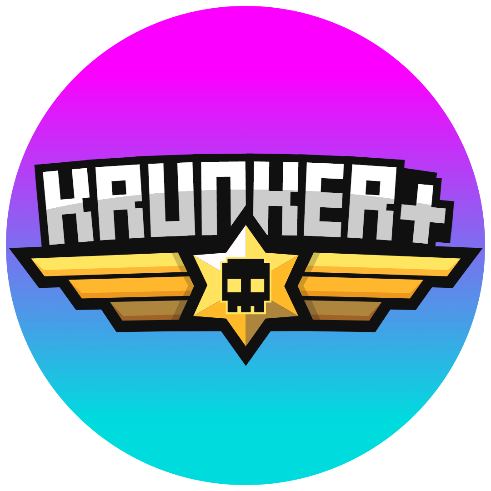

<div id="top"></div>


<!-- PROJECT SHIELDS -->
<!-- [![Forks][forks-shield]][forks-url]  -->
[![Stargazers][stars-shield]][stars-url]
[![Issues][issues-shield]][issues-url]
[![License][license-shield]][license-url]


<!-- PROJECT LOGO -->
<br />
<div align="center">
  <a href="https://github.com/krunkerplus/KRPlusClient">
    
  </a>

<h3 align="center">ZYME Client</h3>

  <p align="center">
    Just a krunker client ig
    <br />
    <br />
    <br />
    <a href="https://github.com/krunkerplus/KRPlusClient/issues">Report Bug</a>
    ·
    <a href="https://github.com/krunkerplus/KRPlusClient/issues">Request Feature</a>
  </p>
</div>


<!-- TABLE OF CONTENTS -->
<details>
  <summary>Table of Contents</summary>
  <ol>
        <li><a href="#built-with">Built With</a></li>
      </ul>
    </li>
    <li>
      <a href="#getting-started">Getting Started</a>
      <ul>
        <li><a href="#prerequisites">Prerequisites</a></li>
        <li><a href="#installation">Installation</a></li>
      </ul>
    </li>
    <li><a href="#contributing">Contributing</a></li>
    <li><a href="#license">License</a></li>
    <li><a href="#contact">Contact</a></li>
    <li><a href="#acknowledgments">Acknowledgments</a></li>
  </ol>
</details>


### Built With

* [Node.js](https://nodejs.org)
* [Express.js](https://expressjs.com)


<p align="right">(<a href="#top">back to top</a>)</p>


<!-- GETTING STARTED -->
## Getting Started

This is an example of how you may give instructions on setting up your project locally.
To get a local copy up and running follow these simple example steps.

### Prerequisites

This is an example of how to list things you need to use the software and how to install them.
* OS
```sh
Make sure you have Windows 10 installed. Windows 11 will not work
```

### Installation

1. Download the correct installation process for your machine i.E(x64 x32, or regular install) setup file from [Releases](https://github.com/krunkerplus/KRPlusClient/releases)

2. Run the setup exe


<p align="right">(<a href="#top">back to top</a>)</p>


<!-- LICENSE -->
## License

See [License](https://github.com/krunkerplus/KRPlusClient/blob/5cd2e75f3e1ec7a48371297aa740905e59f4d7e2/LICENSE)

<p align="right">(<a href="#top">back to top</a>)</p>


<!-- CONTACT -->
## Contact

Discord - [https://discord.gg/tE9742JeAS](https://discord.gg/tE9742JeAS)

Project Link - [https://github.com/krunkerplus/KRPlusClient](https://github.com/krunkerplus/KRPlusClient)

<p align="right">(<a href="#top">back to top</a>)</p>


<!-- ACKNOWLEDGMENTS -->
## Acknowledgments

* [Krunker](https://krunker.io/)
* []()
* []()

<p align="right">(<a href="#top">back to top</a>)</p>


<!-- MARKDOWN LINKS & IMAGES -->
[contributors-shield]: https://img.shields.io/github/contributors/krunkerplus/KRPlusClient.svg?style=for-the-badge
[contributors-url]: https://github.com/krunkerplus/KRPlusClient/graphs/contributors
[forks-shield]: https://img.shields.io/github/forks/krunkerplus/KRPlusClient.svg?style=for-the-badge
[forks-url]: https://github.com/krunkerplus/KRPlusClient/network/members
[stars-shield]: https://img.shields.io/github/stars/krunkerplus/KRPlusClient.svg?style=for-the-badge
[stars-url]: https://github.com/krunkerplus/KRPlusClient/stargazers
[issues-shield]: https://img.shields.io/github/issues/krunkerplus/KRPlusClient.svg?style=for-the-badge
[issues-url]: https://github.com/krunkerplus/KRPlusClient/issues
[license-shield]: https://img.shields.io/github/license/krunkerplus/KRPlusClient.svg?style=for-the-badge
[license-url]: https://github.com/krunkerplus/KRPlusClient/blob/b7870f555e191e55e1d6c4c5e9483be60ca52807/LICENSE